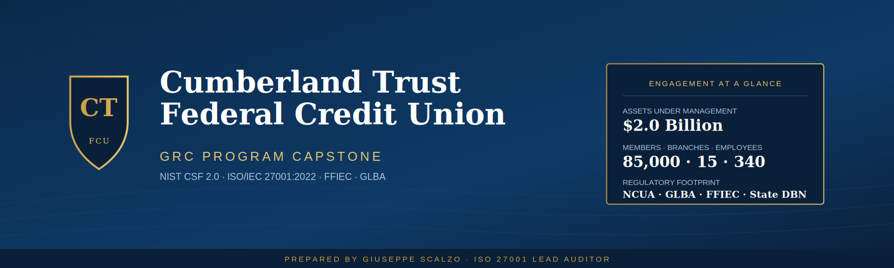
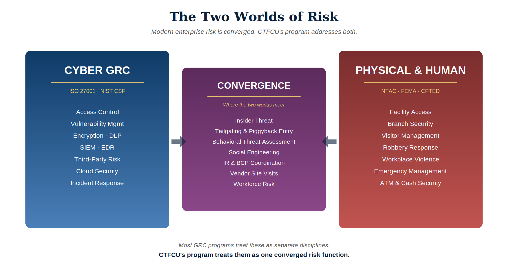
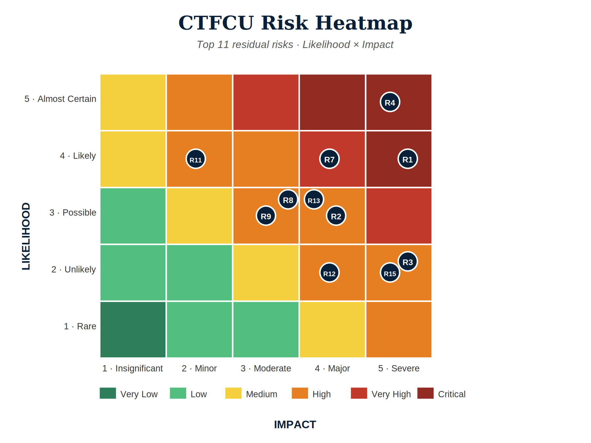
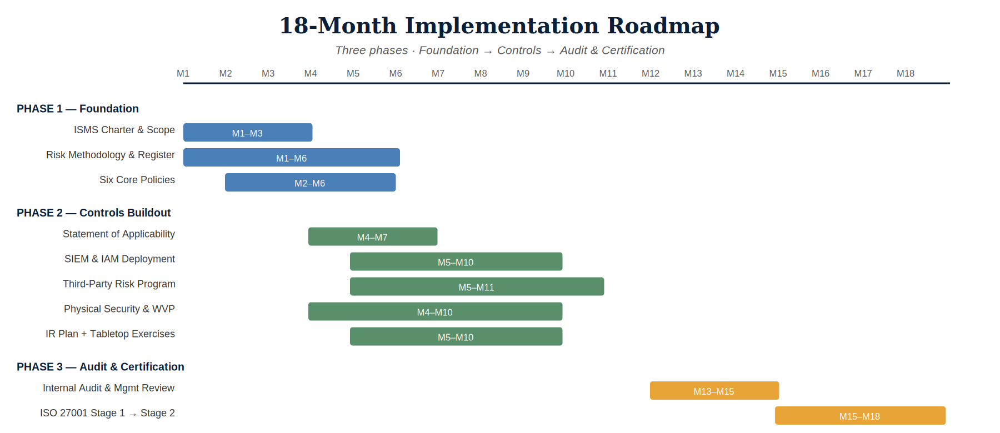

  

<h1 align="center">A Complete Governance, Risk & Compliance Program</h1>

  <em>A Governance, Risk & Compliance (GRC) engagement built end-to-end for a $2B regional credit union — aligned to the NIST Cybersecurity Framework (CSF) 2.0, ISO/IEC 27001:2022, the Federal Financial Institutions Examination Council (FFIEC), and the Gramm-Leach-Bliley Act (GLBA).</em>

  <strong>Author:</strong>&nbsp;Giuseppe Scalzo&nbsp;·&nbsp;ISO 27001 Lead Auditor&nbsp;·&nbsp;B.S. Cybersecurity <em>(Summa Cum Laude)</em> 
  <a href="https://linkedin.com/in/giuseppe-scalzo-">LinkedIn</a>&nbsp;·&nbsp;<a href="https://github.com/GScalzo21">GitHub</a>&nbsp;·&nbsp;GScalzo21@gmail.com

---

## The Engagement

In **Q1 2026**, Cumberland Trust Federal Credit Union (CTFCU) — a $2B regional credit union serving 85,000 members across Tennessee, Kentucky, and Alabama — experienced a phishing incident that resulted in one compromised employee account. The account was disabled within four hours and no member data was exfiltrated, but the incident surfaced during the credit union's annual examination by the **National Credit Union Administration (NCUA)** and triggered findings around cybersecurity governance, third-party risk oversight, and incident response maturity.

In response, the CTFCU Board of Directors authorized an **18-month engagement** to design and deliver a formal **Information Security Management System (ISMS)** — the foundational governance program required by ISO 27001 — aligned to **NIST CSF 2.0** and **ISO/IEC 27001:2022**, with the goal of pursuing ISO 27001 certification by September 2027.

I was engaged as the **fractional GRC consultant** responsible for designing the program: charter, scope, risk methodology and register, control framework mapping, third-party risk model, physical security integration, incident response plan, and a phased implementation roadmap.

---

## What Sets This Engagement Apart

Most credit union security programs treat cyber risk and physical risk as separate disciplines. They sit in different departments, report to different executives, and never converge. The CTFCU program treats them as **one converged risk function** — because real incidents (phishing leading to insider exfiltration, branch-level workplace violence, third-party compromise) don't respect those silos.

  

This convergence is the engagement's defining choice. It reflects how modern enterprise risk actually works — and it's why CTFCU's program includes a **Behavioral Threat Assessment Team (BTAT)** chaired by Human Resources, a **workplace violence prevention** annex aligned to the National Institute for Occupational Safety and Health (NIOSH) and the U.S. Secret Service National Threat Assessment Center (NTAC), and a **branch security** framework alongside the standard cyber GRC stack.

---

## Risk Posture — Top 11 Residual Risks

The full risk assessment identified 15 risks across cyber, physical, behavioral, regulatory, and operational categories. After controls are applied, the residual risk profile looks like this:

  

The two highest residual risks — **Ransomware (R1)** and **Phishing Credential Compromise (R4)** — drive the Phase 2 control sequence: Security Information & Event Management (SIEM) platform deployment, Multi-Factor Authentication (MFA) on all administrative systems, an immutable backup tier, and phishing-resistant authentication (such as FIDO2 hardware keys).

| Rank | Risk | Residual | Owner |
|---|---|---|---|
| 1 | **R1** · Ransomware on production systems | Critical (20) | Chief Information Officer |
| 2 | **R4** · Phishing credential compromise | Critical (20) | Information Security Manager |
| 3 | **R7** · Critical third-party (vendor) compromise | Very High (16) | Chief Risk Officer |
| 4 | **R2** · Insider privileged user abuse | High (12) | CIO + Human Resources |
| 5 | **R8** · Unpatched critical vulnerabilities | High (12) | IT Operations Manager |
| 6 | **R15** · Workplace violence at branch or HQ | High (10) | Human Resources + Physical Security |

📊 **Full quantitative register — view two ways:**
- **[Risk Register (PDF — opens in browser)](./CTFCU-Risk-Register.pdf)** — 4-page preview of all sheets, no download required
- **[Risk Register (Excel)](./CTFCU-Risk-Register.xlsx)** — the live spreadsheet with 47 formulas, conditional formatting, and the full treatment plan ($893K capital and $387K annual operating roll-up)

---

## Frameworks Applied

The program is designed against five overlapping frameworks chosen for the credit union sector:

| Framework | Purpose |
|---|---|
| **NIST Cybersecurity Framework (CSF) 2.0** | Strategic outcome model published by the U.S. National Institute of Standards and Technology — Govern, Identify, Protect, Detect, Respond, Recover |
| **ISO/IEC 27001:2022** | International standard for designing an Information Security Management System; 93 controls in Annex A |
| **FFIEC Cybersecurity Assessment Tool (CAT)** | Federal Financial Institutions Examination Council maturity model — the federal-sector benchmark for U.S. financial institutions |
| **GLBA Safeguards Rule** | The cybersecurity provisions of the Gramm-Leach-Bliley Act (16 CFR Part 314) — U.S. federal law requiring financial institutions to protect nonpublic personal information (NPI) |
| **NCUA Cybersecurity Expectations** | Cybersecurity oversight specific to federally chartered credit unions, enforced by the National Credit Union Administration |

Supporting references include NIST Special Publication 800-30 (risk assessment methodology), ISO/IEC 27005 (risk management process), NTAC behavioral threat assessment, MITRE ATT&CK (the industry-standard catalog of adversary techniques), and the Cybersecurity & Infrastructure Security Agency (CISA) Cross-Sector Cybersecurity Performance Goals.

---

## Policy Library

The engagement delivered **six core policies** that form the foundation of CTFCU's Information Security Management System. The full text of the foundational policy — the **Information Security Policy** required by ISO 27001 Clause 5.2 — is included in this repository as a representative example.

📁 **[View the policy library →](./policies/)**

The included sample policy demonstrates the structure, governance roles, risk authority tiering, and convergence framing applied across the full six-policy set. The remaining five policies follow the same template and review cadence:

| # | Policy | ISO 27001 Reference |
|---|---|---|
| 1 | Information Security Policy *(included as full sample)* | Clause 5.2 |
| 2 | Access Control Policy | Annex A.5.15–A.5.18 |
| 3 | Acceptable Use Policy | Annex A.5.10, A.6.3 |
| 4 | Third-Party Risk Management Policy | Annex A.5.19–A.5.22 |
| 5 | Incident Response Policy | Annex A.5.24–A.5.28 |
| 6 | Business Continuity & Disaster Recovery Policy | Annex A.5.29–A.5.30 |

---

## Implementation — 18 Months in Three Phases

  

**Phase 1 — Foundation** (Apr–Sep 2026) · Governance, risk methodology, register, and six core policies. The "Plan" half of the ISO 27001 Plan-Do-Check-Act (PDCA) improvement cycle.

**Phase 2 — Controls Buildout** (Jul 2026–May 2027) · Statement of Applicability (SoA) — the ISO 27001 document showing which of the 93 Annex A controls apply and how each is implemented. SIEM and Identity & Access Management (IAM) deployment, third-party risk program, physical security and workplace violence prevention program, Incident Response (IR) plan with tabletop exercises.

**Phase 3 — Audit & Certification** (Apr–Sep 2027) · Internal audit cycle, management review, ISO 27001 Stage 1 (documentation review), remediation, Stage 2 (operational audit), and certification.

**Total program cost:** ~$893K capital expense + ~$387K annual operating expense, including the SIEM platform, IAM and Privileged Access Management (PAM) tooling, immutable backups, ATM anti-skimming hardware, branch security hardening, training, cyber insurance, and external audit fees.

---

## How Success Is Measured

The program is built to be measurable. Key metrics reported quarterly to the Board:

| Metric | Baseline | Month 18 Target |
|---|---|---|
| FFIEC cybersecurity maturity rating | Evolving | Advanced |
| ISO 27001 Annex A controls implemented | 24 of 93 (26%) | 82 of 93 (88%) |
| Multi-Factor Authentication (MFA) coverage on administrative systems | ~30% | 100% |
| Phishing simulation click rate | Not measured | < 5% |
| Patch SLA compliance (Critical / 14-day) | Not measured | ≥ 95% |
| Third-party vendors with current SOC 2 / ISO evidence | 0% | 100% of Tier 1–2 |
| Mean Time to Detect (MTTD) for Tier 1 systems | Not measured | < 4 hours |
| Annual tabletop exercises conducted | 0 | ≥ 2 |

*(SOC 2 is the American Institute of Certified Public Accountants' report on a service organization's security controls — the gold standard for vendor risk evidence in the U.S.)*

---

## Lessons Learned

A few things this engagement reinforced that don't always show up in framework documentation:

- **Frameworks are scaffolding, not the building.** ISO 27001 tells you *what* an ISMS needs. It doesn't tell you how to actually get a credit union with 340 employees and 60+ vendors to operate it. The implementation roadmap matters more than the Statement of Applicability.
- **Physical risk belongs on the same risk register as cyber risk.** Separating them creates governance gaps that real incidents will exploit. Workplace violence, branch robbery, and ATM tampering are information security risks too.
- **Third-party (vendor) risk is the loudest underestimated risk.** CTFCU has 66 third parties. Six are critical. None had formal risk tiering at engagement start. This is the most common gap in regional financial institutions, and the hardest to fix retroactively because contracts are already signed.
- **Sustainability matters more than ambition.** The cleanest ISMS in the world is useless if it requires the consultant to operate it. Every deliverable in this engagement was built to be owned by internal CTFCU staff by Month 18.

---

## Beyond Month 18

ISO 27001 certification is not the finish line — it's the baseline. The program is designed to continue under CTFCU's own ownership through the annual ISO surveillance audit cycle, the quarterly Information Security Steering Committee, and the ongoing Plan-Do-Check-Act (PDCA) cycle defined in ISO 27001 Clause 10. Continuous improvement is the point of the framework, not a side effect.

---

## About the Author

I built this capstone to demonstrate end-to-end GRC delivery — not just framework knowledge. The methodology applies across industries; the artifacts here would work substantially the same way for a hospital system, a SaaS company, or a manufacturing firm. I chose a credit union because the regulatory stack is rich and the convergence of cyber + physical risk is real.

My background sits on two sides of the risk house that rarely appear on the same résumé: **eleven years of investigations** — five years as a Detective in the New York City Police Department's Domestic Violence Unit, currently a School Resource Officer in the Metro Nashville Police Department's School Safety Division — paired with **modern GRC and security operations work** as an **ISO 27001 Lead Auditor**, a B.S. in Cybersecurity *summa cum laude*, a recent Cybersecurity Internship in Vulnerability Management & GRC at Log(N) Pacific, and a 2nd place finish at the **Counterattack Cyber Solutions** incident response tabletop competition.

That dual background is why this capstone treats physical security and workplace violence prevention as first-class GRC concerns, not afterthoughts.

I'm available for **remote part-time, contract, and fractional GRC, risk, threat management, and compliance engagements**. Reach me at **GScalzo21@gmail.com** or via [LinkedIn](https://linkedin.com/in/giuseppe-scalzo-).

---

<em>Cumberland Trust Federal Credit Union is a fictional entity created for this engagement. All frameworks, controls, methodologies, costs, and risk treatments are real and current as of 2026.</em>

